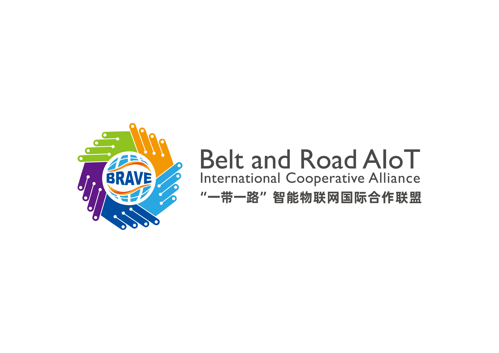

# All the content

## 2023 年前要求

**IEEE AIoT Conference 2023**

**Introduction:**

Artificial Intelligence of Things (AIoT), refers to the integration of artificial intelligence (AI) technologies with the Internet of Things (IoT). This integration allows AIoT end, edge, and server devices connected to the internet, such as smart home devices and industrial equipment, they collect, analyze, and act on data in real time. The combination of AI and IoT enables a wide range of applications, including predictive maintenance, automation, and improved decision-making. For example, an AIoT system in the factory could monitor equipment and predict when it is likely to fail, allowing maintenance to be scheduled before a breakdown occurs. The AIoT system could optimize energy consumption in the smart home by learning a household's patterns and adjusting settings accordingly. The IEEE AIoT Conference 2023 is an event focused on the artificial intelligence (AI) and the Internet of Things (IoT) intersection. The conference brings together researchers, industry professionals, and practitioners worldwide to share their latest findings, insights, and innovations. The IEEE AIoT Conference 2023 will include a highly selective program of technical papers accompanied by workshops, demos, panel discussions, and keynote speeches. We welcome high-quality articles that describe original and unpublished research advancing state of art in ubiquitous intelligence and computing.

Topics for submissions include but are not limited to the following:

- Networked system hardware and platforms
- Ubiquitous connectivity communication paradigms
- Low-power wireless protocols and designs
- Operating systems and network stacks
- System services such as time and location estimation
- Energy harvesting and management
- Resource-efficient machine learning for AIoT platforms
- Mobile and pervasive systems with networked sensing
- Data management and analytics
- Perception, understanding, and adaptation learning algorithms
- Heterogeneous collaborative sensing
- Security and privacy in networked AIoT systems
- Fault-tolerance and dependability
- Deployment experiences
- Data management for AIoT applications
- Resource-efficient machine learning and AI for AIoT devices
- Security and privacy in AIoT systems
- Novel AIoT applications using machine learning
- Techniques and systems for novel human-machine interactions and experiences
- Infrastructure support for AIoT computing
- Software architectures for AIoT devices and computing
- Operating systems for AIoT devices
- System-level energy management for AIoT devices

**General Chairs**

•  XXX

**Program Chairs**

•  XXX

**Program Vice-Chairs**

•  XXX

**Publicity Chairs**

•  XXX

**Workshop Chairs**

•  XXX

**Journal Special Issue Chairs**

•  XXX

**Steering Committee**

•  XXX

**Confirmed Program Committee**

(Sort in alphabetical order)

·  XXX

## 20230208 要求

网站更新：

会议首页主页：

- banner：图片换成西安的一张大图片。 会议日期： oct19-22， 2023，地点在xi'an，图片大小参考 https://2023.ieeeicassp.org/
- 主页内容包括introduction、topics、important date 和 sponsors。
- introduction和topics在之前的word文档里
- date部分：

  - paper submission deadline: 2023年7月31日
  - notification: 8月31
  - camera ready: 09-21
  - conference date： 10月19-22
- sponsors部分

  - IEEE Xi'an: 在网站上找一个logo图片，最好是英文版的
  - 西工大：西工大的英文logo
  - the Belt and Road AIoT International Cooperative (BRAVE) Alliance: 

其他页面参考icassp网站除了industry之外都先列出来，空白的部分写上comming soon，先更新：

- important date页面
- call for paper页面

Organizing Committee:

完整信息

Honorary Chair

- Zhiwen Yu, Harbin Engineering University / Northwestern Polytechnical University, China

General Chairs

- Bin Guo, Northwestern Polytechnical University, China
  --	Vassilis Kostakos, The University of Melbourne, Australia
- Yan Zhang, University of Oslo, Norway

Program Chairs

- Lina Yao, University of New South Wales, Australia
- Chenren Xu, Peking University, China
- Ying Zhang, Northwestern Polytechnical University, China

Program Vice-Chairs
--	Longfei Shangguan, Microsoft, USA【shanggdlk@gmail.com】

- Zhiyong Yu, Fuzhou University, China
- Sicong Liu, Northwestern Polytechnical University, China

Panel Chairs
--	Runhe Huang, Hosei University, Japan
--	Liming Chen, De Montfort University, UK , Ulster University, UK

Industry Chairs--	Rajiv Ratn Shah, IIIT-Delhi, India

- Xiaohai, Bytedance, Singapore

Tutorial Chairs

- Trung Duong, Queen’s University Belfast, UK
- Zhu Wang, Northwestern Polytechnical University, China

Publicity Chairs

- Wen Sun, Northwestern Polytechnical University, China
- Nan Gao, Tsinghua University, China
- Yuxuan Liang, National University of Singapore, Singapore

Special Session Chairs

- Yifang Yin, Institute of Infocomm Research, Singapore
- Longbiao Chen, Xiamen University, China
- Liang Wang, Northwestern Polytechnical University, China

Local & Web Chairs

- Helei Cui, Northwestern Polytechnical University, China
- Yunji Liang, Northwestern Polytechnical University, China
- Bo Yang, Northwestern Polytechnical University, China
- Zhuo Sun, Northwestern Polytechnical University, China

## 20230210 修改意见

工业界那几个字麻烦去掉。陈龙彪老师的可以加上了。另外，icassp网站上是采用照片+职称这种形式，还麻烦你也按照这个格式更改一下。老师们的照片，需要你在网上找一下。

郭老师说把banner图片换成兵马俑，移动端好像看不到图片，估计还要调整一下。最上面有个IEEE的黑色导航栏，去掉。

conference title里面， Aritificial， Intelligence，Things Systems都要首字母大写，简称是AIoTSys，放在title后面

calls 里面，暂时只保留important dates 和 call for paper两个页面

venue把西安的介绍先放进去。

contact里面，先写郭斌老师和我的邮箱（guob@nwpu.edu.cn，izhangying@nwpu.edu.cn）

program下面，放program，invited talk， best paper award三个子页面

## 20230212 修改内容

你好，请更新以下信息：

更新chair信息，包括以下

- 图片更换：zhiyong yu，sicong liu， wen sun， liang wang
- 文字更换：xiaohai 改为 xiaohai tian， Bytedance改为ByteDance
- 新增chair：
  panel chair：
  1） Runhe Huang, Hosei University, Japan
  2） Liming Chen, Ulster University, UK
  Industry chair
  1）Abhirup Ghosh, University of Cambridge, UK
  2）Feng Wang， Huawei， China
- 新增sponser：
  1） 华为，华为的logo我发给你，
  2） 浪潮，logo从网上爬一下（https://www.inspur.com/）

## 20230214 修改内容

Program Vice-Chairs 请加入zimu zhou， https://zhouzimu.github.io/

venue 更新：
Xi'an, known as Chang'an in ancient times, is one of world-famous four civilized capitals. As a capital, it lasted the longest with the most dynasties, making the greatest influence in Chinese history. As the start of the ancient Silk Road, it has played a unique role in promoting cultural exchanges between China and the West both in history and the future.

Xi’an is a combination of the classic and the modern. The inner city is surrounded by a well-preserved City wall which was re-constructed in the 14th century during the early Ming Dynasty. The Mausoleum of Qin Shi Huang and his Terracotta Army are located 40 km to the east of the city center, in the city's suburbs. The Bell Tower and Drum Tower, both are located at the city's central axis. Meanwhile, Xi’an is open to high-tech and emerging industries. Many technology companies locate in Gaoxin Area. Based on the advanced research facilities and outstanding talents, Xi’an has a strong background on scientific research. In the past decades, this city has been making achievements in multiple areas.

图片下面加上兵马俑，钟楼和大雁塔的英文名

Conference Policies

Non-Presented Paper (No-Show) Policy: Any accepted paper included in the final program is expected to have at least one author or qualified proxy attend and present the paper at the conference. If a paper is not presented at the conference, the paper will not be published by IEEE on IEEE Xplore® or other public access forums, but these papers will be distributed to conference attendees as conference proceedings and the copyright of these papers will belong to IEEE.

Exceptions to this policy will be made by the Technical Program Chair(s) of the conference only if there is evidence that the no-show occurred because of unanticipated events beyond the control of the authors, and every option available to the authors to present the paper was exhausted. The no-show authors may appeal the decision of the Technical Program Chair to the VP-Conferences.

Conference Paper Reproducibility and Supporting Content
It is recommended that authors are offered the ability to share datasets, code and other supporting content associated with accepted papers. The below platforms support reproducibility and publicity for posters and/or presentation files that accompany a conference paper. These below options can be added to the Call for Papers, conference website, and author acceptance email, as well as mentioned during the conference:
•	Increase the visibility, impact, and reproducibility of your research.
•	Free resources are available to upload content associated with your paper

IEEE Event Terms and Conditions
https://www.ieee.org/conferences/event-terms-and-conditions.html
IEEE Privacy Policy
https://www.ieee.org/security-privacy.html

新增一栏 general co-chair， Shibo He， Zhejiang Univerisity， https://person.zju.edu.cn/shibohe

## 20230217 更新

1)新增general chair
Vassilis Kostakos, The University of Melbourne, Australia
https://scholar.google.com/citations?user=JnWGV4kAAAAJ&hl=en
2)新增tutorial chair
Weiwei Jiang, University of Melbourne, Australia
http://www.weiweijiang.xyz/

## 20230310 更新

**General Paper Submissions**

Prospective
authors are invited to submit full-length papers (up to 8 pages including
references), short papers (up to 4 pages including references), or extended abstracts , via the AIoTSys 2023 conference website.
Manuscripts should be original (not submitted/published anywhere else) and
written in accordance with the standard double-column paper template. The
accepted abstracts will not be published, however the abstracts and/or the presentations
will be included in AIoTSys 2023 conference program. Accepted papers and
abstracts will be scheduled in lecture and poster sessions.

**Contributed
Papers**

**Papers to AIoTSys 2023 can be submitted** on Easychair: **https://easychair.org/conferences/?conf=2023aiotsys
**

All papers are to be submitted in PDF with [IEEE Conference Proceeding format](https://www.ieee.org/conferences/publishing/templates.html).

The reviewing process of the ICSIP conference aims to provide authors with
constructive feedback on their papers, even when a submission is rejected. All
submissions will be subjected to double-blind peer reviews, who are expert or
have been experiencing in the related field for years. The accepted papers must
be revised, taking into consideration the referees' comments and suggestions,
before inclusion in the conference proceedings.

**Paper
Presentation**

All accepted paper should have at least one author or qualified proxy registered
and attend/present the paper at the conference.

Authors who anticipate inability to travel to a conference because of a
government-imposed travel restriction are still encouraged to submit papers.
Such papers will be reviewed and accepted on their own merit for publication in
Conference Proceedings, without any knowledge of the author’s travel
restriction. Within one week of paper acceptance notification,
travel-restricted authors must notify the conference secretary with proof of
their restriction. Substitute presenters may be possible or, depending on
conference resources, such as a remote presentation or pre-recorded video.

## 20230324 更新

-在主页topics下面加入一段说明 （第一个word文件）
-去除sigbed的logo
-加入两个新的页面（Calls下面）： Call for CAA Special Track （先保持空白）以及 Call for SIGBED CHINA Special Track（第二个word文件）

-删除PAPER SUBMISSION-AIOTSYS SUBMISSION AND PAPER PRESENTATION 页面

Other than the general tracks, AIoTSys 2023
hosts two special tracks:

Ÿ
CAA special track

Ÿ
SIGBED CHINA special track

For papers submitted to these special
tracks, they will be peer reviewed by the guested PCs and editors. The accepted
papers, after conference presentation and extension, will be recommended to
selected journals as fast submission. Please checked the information from CAA
special track and SIGBED CHINA special track.

Cal for paper: 2023 AIoTSys SIGBED CHINA Special Track (Artificial intelligent sensing
with radio, light and acoustic)

**1.
****Introduction:**

With
the fast growth of the artificial Internet of Things (AIoT), various ambient
signals have been established as a powerful medium for ubiquitous sensing,
which quickly becomes an active cross-disciplinary research area that involves
wireless communication, signal processing, machine learning, and even hardware
design. The explosive progress in mobile sensing, especially contactless
sensing provides another dimension to design and develop solutions and systems
for many artificial intelligent sensing problems.

This Special CAA Track，sponsored by SIGBED CHINA, aims to collect original and high-quality
submissions that artificial intelligent sensing with ambient radio, light and acoustic signals to solve problems
in contactless and non-intrusive sensing models and algorithms, AI-driven
sensing applications and solutions for all related field. The interested topics
include but not limited to:

l
New platforms and hardware designs for sensing systems

l
Various sensing systems, including camera, WIFI, RFID, radar, acoustic,
etc.

l
Device-free and non-intrusive sensing

l
Mobile crowdsensing and application

l
Sensing data analysis, process and management

l
Models for contactless sensing, understanding, and adaptation

l
AI-enabled sensing algorithms and systems

l
Intelligent Technologies and Systems for Smart Healthcare

l
Sensing applications, including vital sign sensing, fall detection,
gesture recognition, activity sensing and etc.

l
Systems for location, tracking, context sensing and awareness

l
Non-traditional topics that bring new perspectives to mobile sensing

**2.
****Submission information:**

Stage One: AIoTSys Conference
Submission

Ÿ   Deadline: June 15, 2023.
Please submit your short paper (4 pages including all reference) to AIoTSys SIGBED CHINA Special Track
before the conference deadline. All papers will be peer reviewed by
guested PCs. The paper must follow the conference submission guideline.

Ÿ   Notification:  31 August 2023

Ÿ   Camera ready submission: 21 September 2023

Ÿ   Stage Two: CCF Transactions on Pervasive Computing and Interaction
Submission, (optional) FULL paper submission: Accepted high quality papers in
this track will be invited to[ CCF
Transactions on Pervasive Computing and Interaction (Special Issue on
Intelligent Technologies and Systems for Smart Healthcare) ](https://www.mdpi.com/journal/electronics/special_issues/25DIEG6924)as a fast
submission, candidate authors could prepare your full paper according to the
Journal Guideline.

Ÿ   Conference Presentation：2023, Oct 19-22. All
papers that are accepted at AIoTSys SIGBED CHINA special track must be
presented at AIoTSys conference. Papers without presentation will not be
recommended as the Journal’s fast submission.

**3.
****Guested PCs and special
editors:**

Fusang Zhang （Institute
of Software, Chinese Academy of Sciences）

Jia Liu （Nanjing
University）

En Wang（Jilin
University）

Lili Chen（Tsinghua
University）

## 20230409 更新

更新1Call for CAA Special Track 页面加入（见word）
更新2local chair 加入西工大Huan Zhou（见图片）

Call for Paper: 2023 AIoTSys CAA Special Track

1. Introduction:

Artificial Intelligence of Things (AIoT) is considered a collaborative application of Artificial Intelligence (AI) and the Internet of Things (IoT). With the fast growth of Internet of Things (IoT), vehicular networks, and the advent of 5G/6G, there are more rigorous performance requirements (e.g., ultra-low latency and ultra-high reliability) for advanced communication and networking techniques that enable the emerging high mobility applications.

Future AIoT systems will provide intelligent wireless connections with a high data rate for anyone at anytime and anywhere with the aid of AI, for example when traveling in high-speed trains and highway vehicles. These high mobility scenarios result in rapidly time-varying channels, which pose urgent demands for AI-empowered large-scale communications as well as significant challenges for the design of communication and networking models and technologies for AIoT.

This Special CAA Track, sponsored by CCF-CAA, aims to collect original and high-quality submissions that target the relevant theoretical aspects and practical design of advanced communication and networking techniques for high mobility networks. The topics of interest include but are not limited to:

	Rapidly time-varying channel modeling, estimation, and equalization
	Machine learning-based big data analytics for AIoT systems
	Security and privacy in AIoT systems
	Doppler shift estimation and compensation
	Efficient modulation and detection techniques for highly mobile environments
	Highly dynamic radio resource optimization
	Multiple access schemes for AIoT
	Ultra-high reliability routing protocols
	Relay, distributive multi-antenna, and cooperative techniques
	Communication and networking for highly mobile underwater IoT
	Next generation techniques for highly mobile optical wireless communications

Keywords:
Artificial Intelligence, IoT, Communication and Networking

2. Submission information:

1) Stage One: AIoTSys Conference Submission
   	Deadline: June 15, 2023.  Please submit your short paper (4 pages including all reference) to AIoTSys CAA Special Track before the conference deadline. All papers will be peer reviewed by guested PCs. The paper must follow the AIoTSys paper submission guideline.
   	Notification:  31 August 2023
   	Camera ready submission: 21 September 2023
2) Stage Two:  MDPI electronics Journal Submission, Impact Factor 2.690
   	(optional) FULL paper submission:  Accepted papers in AIoTSys CAA Special Track will be invited to MDPI Electronics Journal as a fast submission, candidate authors could prepare and submit your full paper according to the journal guideline.
   	Conference Presentation：2023, Oct 19-22. All papers that are accepted at AIoTSys CAA track must be presented at AIoTSys conference. Papers without presentation will not be recommended as journal’s fast submission.

3. Guested PCs and Special Editors:
   Prof. Dr. Shibo He (Zhejiang University, China)
   Dr. Fangyuan Xing (Southeast University, China)
   Prof. Dr. Victor C. M. Leung (The University of British Columbia, Canada)
   Dr. Lei Yang (University of Nevada, Reno, NV 89557, USA)
   Prof. Dr. Huan Zhou (College of Computer Science and Technology, China)

## 20230418 update

1. 把paper submission 下面Submit an aiotsys conference paper 这个空白页面去掉
2. 把paper submission 下面 aiotsys paper guidelines这个页面：

- -这一页的名字改成AIoTSys Paper Submission and Guidelines
  --在Accepted papers and abstracts will be scheduled in lecture and poster sessions. 这句下面，加入新的一段内容：
  All papers are reviewed using a single-blind review process: authors declare their names and affiliations in the manuscript for the reviewers to see, but reviewers do not know each other's identities, nor do the authors receive information about who has reviewed their manuscript.
  -- Contributed Papers 下面，“All submissions will be subjected to double-blind peer reviews”改成“All submissions will be subjected to single-blind peer reviews”

## 20230517 update

1.请把下面文字，使用高亮颜色，添加到Important Dates上面：

Papers to AIoTSys 2023 can be submitted on Easychair:
https://easychair.org/conferences/?conf=2023aiotsys

2. sponsor里面，加入西北工业大学科学技术研究院（https://kyy.nwpu.edu.cn/）、西北工业大学科学技术协会（https://www.scimall.org.cn/org/orgSample?id=17709&menu_id=2445）的标志。请从两个主页里提取一下图片信息。

## 20230601 update

### CFP-AIIOT-Track

Title: Artificial intelligence for the Industrial Internet of Things (AIIoT)

1. Introduction
   Artificial intelligence (AI) is a key component in the Industrial Internet of Things (IIoT) ecosystem, which is a network of physical devices, machines, and software applications that communicate and exchange data in order to optimize industrial processes. With the help of AI, IIoT systems can extract valuable insights from large volumes of data generated by sensors, machines, and other connected devices, and use that information to optimize processes, improve efficiency, and reduce costs. AI technologies such as machine learning, computer vision, and natural language processing are being used to enable predictive maintenance, quality control, supply chain management, and other industrial applications. As the IIoT continues to evolve, AI is expected to play an increasingly important role in driving innovation and transforming the way in which businesses operate.

This Special Track aims to collect original and high-quality submissions related to AI in Industrial Internet of Things. The topics relevant to this special issue include but are not limited to

•	Systems for IoT and services computing
•	Industrial IoT in manufacturing
•	AI technologies in industrial IoT
•	Security and privacy in industrial IoT
•	Wearable devices
•	Cyber-physical systems
•	Software engineering for industrial IoT
•	Machine learning and deep learning approaches for data analysis
•	Social implications for IoT intelligent
•	Resilient and secure IoT with real-world solutions

2. Submission Information
   Please follow the same submission guideline as for the general tracks.
3. Guested editors:
   Helei Cui (Northwestern Polytechnical University)
   Xing Huang (Northwestern Polytechnical University)
   Xiaoning (Maggie) Liu (RMIT University)

### CFP-CCF-UbiComp-Track

CCF Ubiquitous Computing Special Track

1. Introduction:
   Due to improvements in their CPU/GPU capabilities, intelligent mobile devices can now undertake more computing tasks. This computational mechanism is called pervasive and mobile computing. The proliferation of pervasive and mobile computing in intelligent mobile devices is now regarded as an effective mechanism able to assist or change human life. Ubiquitous computing through the design and deployment of various pervasive and mobile computing systems is able to sufficiently perceive various states of humans and things, such as human activities, decision assistance, and health care. It utilizes the computation power of intelligent mobile devices to improve the quality of people's work and life, proving its potential for pervasive and mobile computing. Ideally, computing services will be efficient, reliable, and ubiquitous. However, in reality, the implementation of adaptive and reliable mobile computing systems is still challenging. Maintaining robustness under dynamic network conditions, adapting to dynamic and limited resource constraints, rational energy schedules, protecting data privacy, etc., are still open problems. This Special Issue provides an opportunity for researchers and system developers to address research challenges facing the design, development, deployment, use, and fundamental limits of pervasive and mobile computing systems. We submissions from various fields related to pervasive and mobile computing, wireless communication and networking, embedded systems and hardware, learning algorithms and models, distributed systems and algorithms, data management, and real-world measurement and deployment for mobile systems and applications. Papers on theoretical, practical, and methodological issues in pervasive and mobile computing are welcome. Potential topics include, but are not limited to:
   •	Applications of machine learning to mobile/wireless research;
   •	Mobile health;
   •	Edge computing and resource scheduling based on artificial intelligence algorithms;
   •	Security and privacy of embedded intelligent systems;
   •	Ubiquitous computing and mobile human–computer interaction;
   •	Mobile web, video, virtual reality, and other applications;
   •	System smart spaces (e.g., smart factories, smart workspace, smart agriculture);
   •	Robotic and drone-based networking;
   •	Implanted and wearable computing;
   •	Embedded intelligent operating systems and operating environments;
   •	Embedded intelligence based on sensors, UAVs, and robots;
   •	Intelligent algorithms for the Internet of Things and the physical space of information;
   •	Modeling, simulation, and evaluation tools for embedded intelligent applications;
   •	Experiences, challenges, and comparisons of embedded intelligence platforms;
   •	Data sharing and management based on embedded intelligent algorithms;
   •	New communication paradigms for ubiquitous connectivity;
   •	Low-power wireless media access control, network, and transport protocol designs;
   •	Resource-efficient machine learning for embedded and mobile platforms;
   •	Heterogeneous collaborative sensing, including human–robot sensor systems;
   •	Fault tolerance, dependability, and verification;
   •	Applications and deployment experiences;
   •	Applications of embedded intelligence in health, transportation, smart city, intelligent manufacturing, and other fields;
   •	Security and privacy of embedded intelligent systems;
   •	Embedded intelligent application networks, system architecture, and protocol;
   •	Modeling, simulation, and evaluation tools for embedded smart applications.
2. Submission information:
   Stage One: AIoTSys Conference Submission
   •	Deadline: June 15, 2023. Please submit your short paper (4 pages including all reference) to AIoTSys SIGBED CHINA Special Track before the conference deadline. All papers will be peer reviewed by guested PCs. The paper must follow the conference submission guideline.
   •	Notification: 31 August 2023
   •	Camera ready submission: 21 September 2023
   Stage Two: Applied Sciences (Special Issue on New Insights into Pervasive and Mobile Computing) Submission. (optional)
   •	FULL paper submission: Accepted high quality papers in this track will be invited to Applied Sciences (Special Issue on New Insights into Pervasive and Mobile Computing https://www.mdpi.com/journal/applsci/special_issues/OTU70W6JID) as a fast submission, candidate authors could prepare your full paper according to the Journal Guideline.
   •	Conference Presentation：2023, Oct 19-22. All papers that are accepted at AIoTSys CCF ubiquitous computing special track must be presented at AIoTSys conference. Papers without presentation will not be recommended as the Journal’s fast submission.
3. Guested PCs and special editors:
   •	Lei Xie (Nanjing University)
   •	Sicong Liu (Northwestern Polytechnical University)

### CFP-ISCC-Track

Title: Integrated Sensing, Communication, and Computation (ISCC) for AIoT: Technologies, Emerging Trends and Challenges

1. Introduction
   The Internet of Things (IoT) has the potential to play a significant role in creating a more sustainable and green future. With the rapid development of Artificial Intelligence (AI) technology, AIoT (Artificial Intelligence of Things) has recently become a hot topic that combines two of the hottest acronyms. Empowered by AI, IoT enables a variety of intelligent services across a myriad of fields for smart cities and industries including manufacturing and agriculture, by performing integrated sensing, communication, and computation (ISCC). In this context, to keep pace with the explosive growth of AIoT traffic, wireless systems must support ultra-high bandwidth, low latency, reliable connections, and flexible resource allocation. Despite a great amount of effort made regarding applying AI to IoT, AIoT still faces technical challenges while designing and deploying ISCC techniques in practice. For instance, complexity, efficiency, scalability, accuracy, and robustness related to the increasing modern AIoT systems and applications. This Special Track is aimed at collecting original and innovative research works that focus on challenging issues in the field of ISCC technologies and applications in AIoT.

The interested topics include but not limited to:
	Integrated sensing, communication, and computing technologies for AIoT
	Recent trends, challenges and emerging applications in ISCC for AIoT
	Resources management and scheduling algorithms for AIoT system
	Advanced machine learning algorithms design for AIoT
	Reconfigurable intelligent surface (RIS)/IRS design and optimization targeting at AIoT
	Energy harvesting and power management for AIoT devices
	Intelligent edge computing/edge intelligence for AIoT
	Hardware designs and circuits of AIoT devices
	Security, privacy, and reliability in AIoT system

2. Submission information
   Please follow the same submission guideline as for the general tracks. High quality accepted paper will be recommended to potential publications:
   (1) MDPI Applied Sciences (IF:2.838): Future Trends in Intelligent Edge Computing and Networking.
   Extended deadline: 30 Jan. 2024.
   (2) A special issue at Springer-Nature Computer Science (SNCS). Detailed information will be posted soon.
3. Track chairs
   Bo Yang (Northwestern Polytechnical University)
   Zhuo Sun (Northwestern Polytechnical University)

把这段文字改成，

Please check the detailed information on the special track webpages.

High quality accepted conference papers (both general and special tracks), after revised and extended, will be recommended to multiple SCI Indexed  journals as fast submissions.

## 20230609 update

Title：Artificial Intelligence and Edge Computing (AIEC) for IoT
Summary：
Recently, the combination of AI and edge computing for IoT has aroused a research upsurge, which helps to achieve efficient computing and intelligent decision-making to ensure the QoS requirements of IoT devices. By deploying intelligence-empowered edge servers, inference computing of IoT devices can be achieved with higher accuracy and lower latency. However, integrating AI with edge computing in the IoT system still raises several major challenges in various aspects of algorithm design, resource allocation, security, privacy, incentive mechanism, etc. This Special Track aims to exploit AI and edge computing-empowered IoT from several perspectives, ranging from its recent advances to intelligent communication/networking technologies. This Special Track will bring together leading researchers from both the industry and academia and solicit their original research and practical contributions on novel architectures, applications, and technologies of AI and edge computing-empowered IoT. We encourage prospective authors to submit related distinguished research papers on the subject of both: theoretical approaches and practical case reviews. 

The interested topics include but not limited to:
	Architectures, applications and services in AIEC for IoT
	Dynamic resources allocation and management in AIEC for IoT
	Resource pricing, economic models and incentive mechanisms in AIEC for IoT
	Wireless resource virtualization in in AIEC for IoT
	Sustainable and green edge computing for IoT
	Mobile big data and social-aware edge computing for IoT
	Artificial intelligence and machine learning for IoT 
	Simulation tools and testbeds in AIEC for IoT
	Security, privacy and trust in AIEC for IoT

2. Submission information
Please follow the same submission guideline as for the general tracks. High quality accepted paper will be recommended to potential publications:
(1) MDPI Applied Sciences (IF:2.838): Future Trends in Intelligent Edge Computing and Networking.
Extended deadline: 30 Jan. 2024.
(2) A special issue at Sensors. Detailed information will be posted soon.

3. Track chairs
Huan Zhou (Northwestern Polytechnical University)
Liang Zhao (China Three Gorges University)

## 20230615 Delay

## 20230813

add Xudong Yang